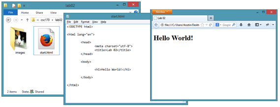
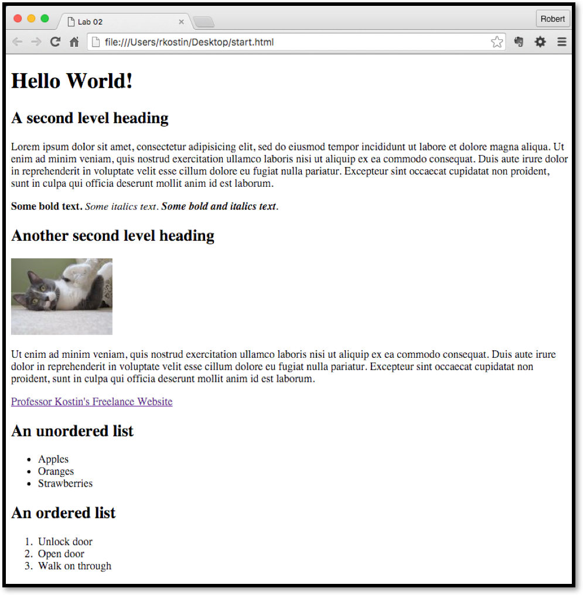

# Lab 2: First HTML Webpage
*Due: Monday, January 28, 2019*

<hr>

In this assignment, you will create a new HTML file and load it with “dummy” content.  Then you will markup the content with HTML tags.  And finally, you will upload the HTML file to your account on the web server.

You will need to remember your FTP account information from the previous lab.

You will have to look-up how to use certain HTML tags.  [www.w3schools.com](https://www.w3schools.com/) is a good web site to use for researching HTML tags and how they work but keep in mind, w3schools.com is not an official reference for web development.  It has outdated information and errors!  Always defer to information from the TAs or the professor.

## Step 1: Create a new HTML file

- On your desktop (or anywhere on your computer’s file system) create a folder titled: **lab02**
- Inside the **lab02** folder, create a folder titled **images**
- Inside the **lab02** folder (not the **images** folder) create a new HTML file named **start.html**
- In your code editor, type the following exactly:

```html
<!doctype html>

<html lang="en">

	<head>
		<meta charset="utf-8">
		<title>Lab 02</title>
	</head>

	<body>


	</body>

</html>
```
- Save your file – and generally speaking, save often!

## Step 2:  Add content to your web page

Marketing people use the term “comp” (short for comprehensive layout) to show their clients what their design will look like when it’s built.  For web developers, we use a comp to see a picture of a website, usually drawn by graphic designers using a program like Adobe Illustrator or Photoshop.

For this assignment, you can use the comp provided (see last page of this document) as a guide to gather some placeholder text (“Lorem Ipsum”) and a “FPO” (For Position Only) image.  **It really doesn’t really matter if your webpage looks exactly like the comp.  You only need to use it as a guide.**  (In fact, it’d be better if you experimented with some different content to get a feel for how it works.)

### Prep: Gather some placeholder content

- Get some placeholder text (a.k.a dummy text or lorem ipsum) and keep it handy. You’ll need it later.

- Get a FPO (For Position Only) image.  For our purposes, you need a small image, **no wider than say 200 pixels** or so, and the file type must be: *jpg*, *png* or *gif*.  If you’re not sure, then follow this suggestion: 
  - Go to Google Images ([www.google.com/images](http://www.google.com/images)) and search for something (e.g. cats).
  - Click the “Tools” button and select the “Size” pull down menu.  
  - Select “Icon” (because, for this assignment, we just want a small image).  
  - Click on an image that interests you
  - In the window the stretches open, right-mouse click and save the image to your *images* folder – the one that’s in your *lab02* folder.  (NOTE: instructions for exactly how to save an image from a web browser is different for each type of browser and each operating system.  Sorry, and good luck!)
  - In the Save dialog box that opens, change the filename to something short, all lowercase letters, and no spaces.  (E.g. *cat*)
  - Toggle over to your *images* folder and check your handiwork.  If your file is there and it seems okay, you can close your web browser.

### Start filling your HTML file with content

Using the *comp* on the end of this document as a guide, you will write and paste text into your open HTML file (in your code editor) inside the one `<body>` tag, like this: 

```html
<body>
	(all your text content will go here)
</body>
```

Your goal is to make it look like (but it doesn’t have to be exactly) like the *comp*.

1. Write or copy & paste plain text into your HTML document between the `<body>` tags.  You can start by typing something like this between the `<body>` tags:

  ```html
  <body>
  	<h1>Hello World!</h1>
  	
  </body>
  ```

2. Save your HTML file, toggle back to your lab02 folder and double click your start.html file.  The file will open in a web browser – whatever is the default web browser for your computer.  There, you should see something like this:

  

  For the rest of this section, you will continue to write or copy & paste text into your HTML document, always between the one set of `<body>` tags.  (You can use any bits and pieces of the placeholder text – the *lorem ipsum* stuff – where ever you want.)  As you go, you will need to add “markup” (the tags) to the content.

  3.Format the plain text in your document using HTML tags. Make sure you use at least one example of each of the following types of tags.<br>*WARNING: yes! – you must look-up how to use these tags correctly...*

  - **First level heading**
  - **Second level heading**
  - **Paragraph**
  - **Bold** (strong)<br>Note: do not *ever* use the `<b>` tag
  - **Italic** (emphasis)<br>Note: do not *ever* use the `<i>` tag
  - A **link** to an inline image<br>hint: your “src” will be something like `images/cat.jpg`<br>hint: you will also need to create an "alt", something like `my cat`<br>hint: do **not** use a `height=""` or `width=""` attribute on your image tag<br>*Even though w3schools.com shows an example of an IMG element that uses the **height** and **width** attributes, do NOT use them!  (To be explained in a future lecture.)*
  - A **hyperlink** to another website<br>(hint: your “href” will be something like `http://www.google.com`)
  - An **unordered list**
  - An **ordered list**
  - An HTML **comment** (note: you will not see the comment in the web browser)

Remember: you have reference materials to lookup how to write each tag.  (Use Google and/or w3schools.com.)

- As you write your code.  Use lots of *white space* in the code! Make sure you indent and space your HTML tags appropriately to make it easy to read the code.  

In general, the process is to write some code in the code editor, save it, then toggle to your web browser and refresh the browser.  You will see your edits in the web browser and you will figure out what you need to do next.  Then, you then toggle back to your code editor and start the process over.

## Step 3:  Upload your work
When you are done with your webpage, use an FTP tool (like WinSCP or Cyberduck) to access your account on **csc170.org**  (remember your FTP login information?) and upload your files like this:

1.	Open an FTP tool and login to your account using the login credentials you used in Lab 1.
	.	Drag your **lab02** folder into the online area in your FTP tool.  The result will put all your files and folders on the server.
	.	In a web browser (any), go to this address to check your handiwork: 
  ```www.csc170.org/accountname/lab02/start.html```<br>(where *accountname* is your account name)

## Step 4:  Report your work
1.	In our Blackboard section, in Lab 2, post a link to your webpage to receive credit for this Lab. 

[end of lab instructions]


<hr>

## Comp
Below is your comp to guide the design of your webpage.

Remember: it is *not* important to make your webpage look like this.  In fact, this is a good time to do some experimentation.  


